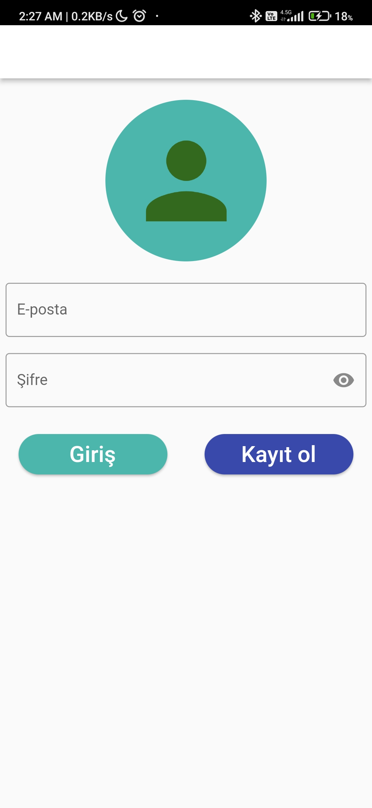
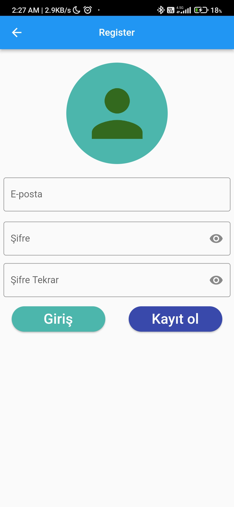
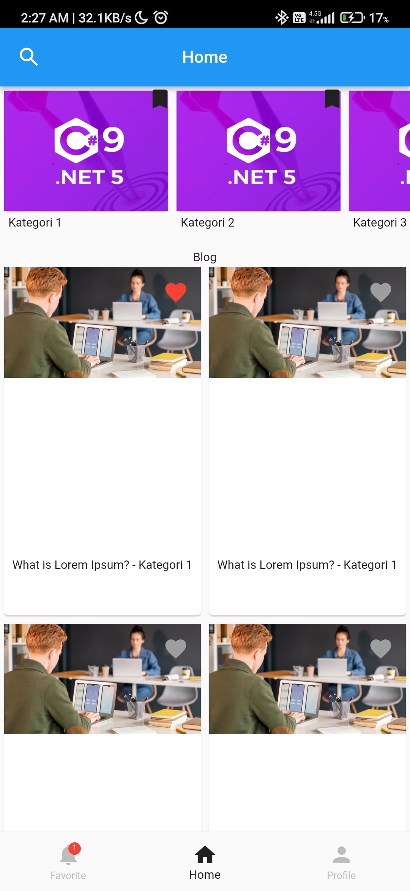
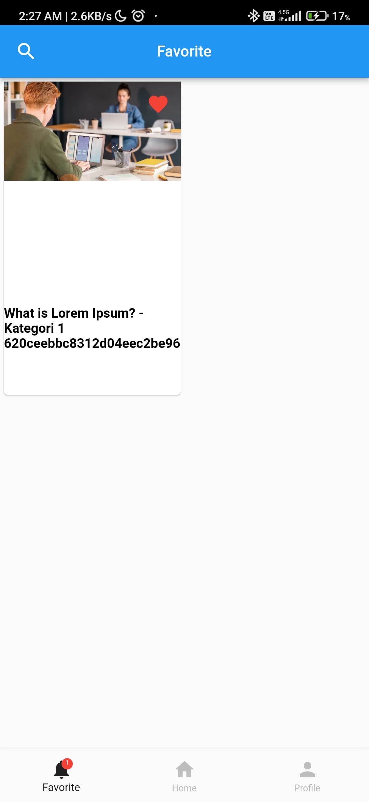
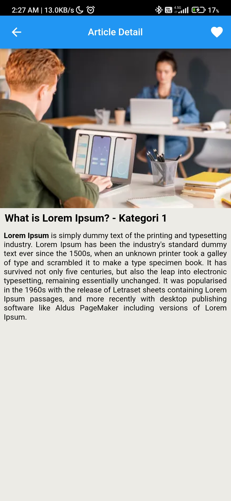
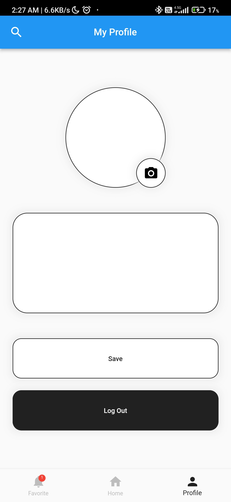
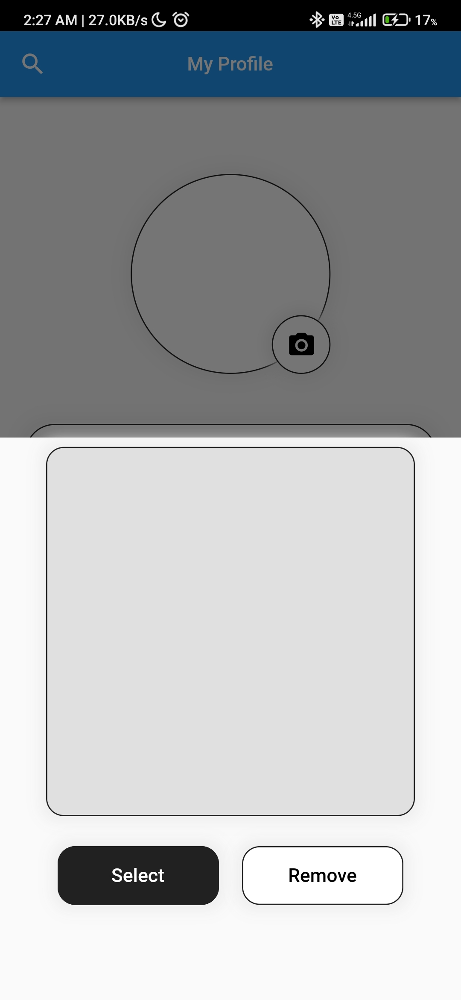
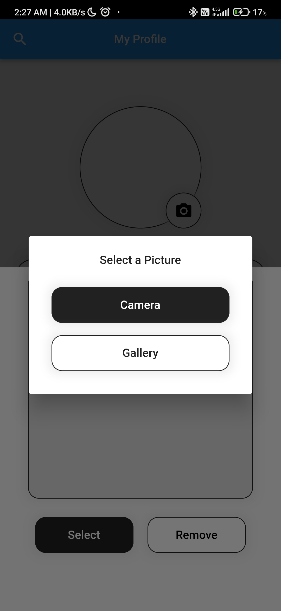

# Blog/REST API assignment

## Packages and methods

- State management:
  - MobX to manage state
  - Provider to inject state managers
- http package to connect with backend
- flutter_html to parse html response from API
- geolocator to get current location
- shared_preferences
- image_picker
- google_maps_flutter

## Screenshots

### Sign in Screen

### Sign up Screen

### Home Screen

### Favorites Screen

### Article Screen

### Profile Screen

### Image Picker modal

